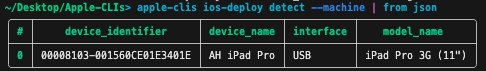
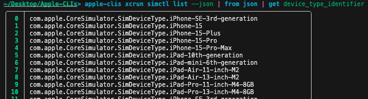
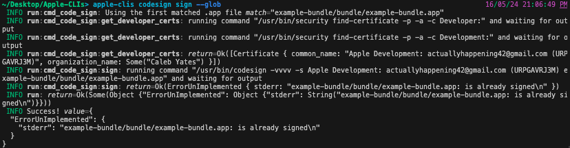

# Apple-CLIs
Collection of crates wrapping various Apple CLIs for documentation and type-safety purposes.

This is heavily a work in progress, and will be added to as I need more functionality for building a 100% Rust app for iOS.

## CLI Install & Usage
The crates.io release is likely behind the development branch, but has a greater chance of working.
```sh
# install from crates.io if it works
cargo install apple-clis
```

Install from source:
```sh
# install from git if crates.io doesn't work / missing features
cargo install --git https://github.com/ActuallyHappening/Apple-CLIs.git apple-clis
```

### Setup with NuShell
**Nushell is completely optional.** It just tends to make life easier for scripting complex data.

If you want completions for your shell, make an issue / PR and I'll add it.
Since I use NuShell (which is really awesome and built in Rust), I've added a command to automatically add completions for NuShell.
```zsh
# if you are using nushell,
apple-clis init nushell --auto

# if you want more control,
apple-clis init nushell --raw-script
```

### General help message
This may be out of date:
```
A collection of Apple command-line tool wrappers, library and CLI

Usage: apple-clis [OPTIONS] <COMMAND>

Commands:
  init        Used for setting up completions
  ios-deploy  
  security    
  spctl       
  codesign    
  xcrun       
  open        
  help        Print this message or the help of the given subcommand(s)

Options:
      --machine  Outputs data as JSON. Aliased to --json. Is global, hence can be used with any command/subcommand except help messages
      --verbose  Overrides the RUST_LOG env variable to use a very verbose log level
  -q, --quiet    Only displays warnings and errors
  -h, --help     Print help
  -V, --version  Print version
```

### Ios-Deploy detect
```sh
# nu shell example
apple-clis ios-deploy detect --json | from json

# normal shell example
apple-clis ios-deploy detect

# corresponding library example
cargo run --example ios-deploy-detect
```


### xcrun simctl list
```sh
# nushell example
apple-clis xcrun simctl list --json | from json | get device_type_identifier

# normal shell example
apple-clis xcrun simctl list
```


### codesign sign
```sh
apple-clis codesign sign --glob
```



### Many more!
I don't have time to manually document each usage, explore each command with `--help` to see if it has been implemented already!
As always, PRs are welcome!

## Example build script
This example `.nu` script uses `cargo bundle`, which you can install with `cargo install cargo-bundle`, and nushell, as an example script to build an iOS app.
```sh
# example Cargo.toml, for `cargo bundle`
# [package.metadata.bundle]
# identifier = "com.example-id"

# let APP_NAME = open Cargo.toml | get package.name | to text;
let BUNDLE_ID = open Cargo.toml | get package.metadata.bundle.identifier | to text

cargo bundle --target aarch64-apple-ios-sim
apple-clis codesign sign --glob
apple-clis xcrun simctl boot --ipad
apple-clis open --well-known simulator
apple-clis xcrun simctl install --booted --glob
apple-clis xcrun simctl launch --booted --bundle-id $BUNDLE_ID
```

## Library usage
This crate has a usable, albeit not stable, API.

### Run Rust Examples
```sh
# clone repo
git clone https://github.com/ActuallyHappening/Apple-CLIs.git
cd Apple-CLIs

cargo run --example ios-deploy-detect
cargo run --example security-find-certificates
cargo run --example simctl
```

## Contributions
PRs welcome!

### Developing
```sh
# try the crates.io release if it works
cargo install --git https://github.com/burtonageo/cargo-bundle.git
brew install ios-deploy
cargo install nu # nushell is really awesome

# build an example bundle from the included example project + run tests
nu test.nu
```